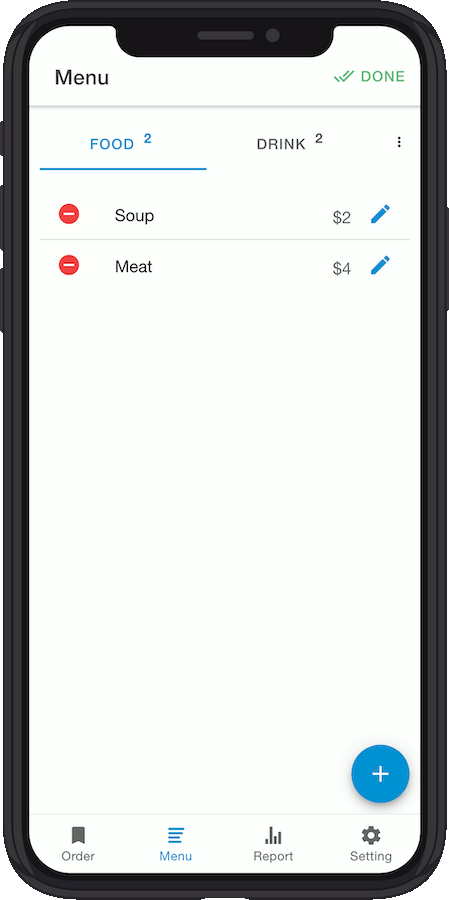

Hybrid Mobile POS Application, based on Ionic 4 & Angular 8


## Demo

- [**Android**](assets/Ionic-PoS-App.apk)
- [**Tutorial Video**](https://www.youtube.com/watch?v=mTEK_snO4T8)

## App screenshots

- Orders / Menu / Report / Settings

   

## Features

- Manage the menu **(Category & Items)**
- Manage the order in the realtime **(Listview & Grid View)**
- Printing receipt via Bluetooth (BLE), **support all [ESCPOS](https://en.wikipedia.org/wiki/ESC/P) printers.**
- Revenue **statistics and reports**
- Integrate **Firebase authentication** (Register/Log In/Reset Password)
- **Synchronize** data to Firebase between devices

## Requirements

- NodeJS
- Cordova
- Ionic
- Angular CLI
- Android Studio ([Developing for Android](https://ionicframework.com/docs/developing/android))
- Xcode ([Developing for iOS](https://ionicframework.com/docs/developing/ios))

## Setup Firebase Account

- Create new project on [the Firebase Console](https://console.firebase.google.com/)

  + Click the Gear icon next to Project Overview
  + In the Your Apps section, create a new app and choose the type Web
  + Give the app a name and copy the config values provided

- Open `/src/environments/environment.ts` and add your Firebase configuration.

```
export const environment = {
  production: false,
  firebaseConfig: {
    apiKey: '<your-key>',
    authDomain: '<your-project-authdomain>',
    databaseURL: '<your-database-URL>',
    projectId: '<your-project-id>',
    storageBucket: '<your-storage-bucket>',
    messagingSenderId: '<your-messaging-sender-id>',
    appId: '<your-app-id>',
    measurementId: '<your-measurement-id>'
  }
};
```

## Add new language

The project use [**ngx-translate**](https://github.com/ngx-translate/core) library for translation.
See an example at here [https://stackblitz.com/github/ngx-translate/example](https://stackblitz.com/github/ngx-translate/example)

- Open `src/app/app.config.js` and add your new app language (ex. French ) to array **SUPPORTED_LANGUAGES**

```
export const SUPPORTED_LANGUAGES: SupportedLanguage[] = [
  ...
  {
    lang: 'fr',
    locale: 'fr-FR',
    name: __('French'),
    currency: {
      symbol: "€",
      name: "Euro",
      symbol_native: "€",
      decimal_digits: 2,
      rounding: 0,
      code: "EUR",
      name_plural: "Euro",
      formatter: {
        is_symbol_prefix: false,
        delimiters: ' |,',
        space_between: true
      } as any
  }
];
```

- Open `packages.json`, add new translation file inside {...}

```
  ...
  "scripts": {
    ...
    "extract": "ngx-translate-extract --input ./src --output ./src/assets/i18n/{en,vi,fr}.json --clean --format json"
  },
  ...
```

You can now run `npm run extract` and it will extract strings from your project.

## Build and Run

Open Terminal and go to project root path

### Install dependencies

```
$ npm install
```

### Run on browser

```
$ ionic serve
```

### Run on Android device

Plug in your Android phone into your PC

#### Run by Ionic CLI

```
$ ionic codrova run android
```

#### Run by Android Studio

- Open Android Studio. Open project located at `platforms/android` directory.
- Select _Run > Run 'app'_

### Run on iOS

```
$ ionic cordova prepare ios
```

- Open Xcode. Open project located at `platforms/ios` directory.
- Plug in your iPhone (iPad) into your PC
- Select Build > and select your device to run the app