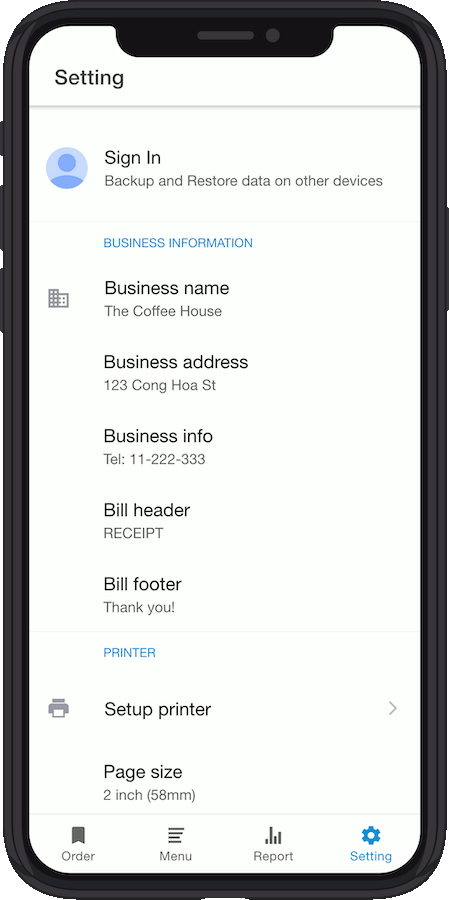

Hybrid Mobile POS Application, based on Ionic 4 & Angular 8


## Demo

- [**Android**](assets/Ionic-PoS-App.apk)
- [**Tutorial Video**](https://www.youtube.com/watch?v=mTEK_snO4T8)

## App screenshots

- Orders / Menu / Report / Settings

   

## Features

- Manage the menu **(Category & Items)**
- Manage the order in the realtime **(Listview & Grid View)**
- Printing receipt via Bluetooth (BLE), **support all [ESCPOS](https://en.wikipedia.org/wiki/ESC/P) printers.**
- Revenue **statistics and reports**
- Integrate **Firebase authentication** (Register/Log In/Reset Password)
- **Synchronize** data to Firebase between devices

## Requirements

- NodeJS
- Cordova
- Ionic
- Angular CLI
- Android Studio
- Xcode (to build iOS)

## Setup Firebase Account

- Create new project on [the Firebase Console](https://console.firebase.google.com/)

  + Click the Gear icon next to Project Overview
  + In the Your Apps section, create a new app and choose the type Web
  + Give the app a name and copy the config values provided

- Open `/src/environments/environment.ts` and add your Firebase configuration.

```
export const environment = {
  production: false,
  firebaseConfig: {
    apiKey: '<your-key>',
    authDomain: '<your-project-authdomain>',
    databaseURL: '<your-database-URL>',
    projectId: '<your-project-id>',
    storageBucket: '<your-storage-bucket>',
    messagingSenderId: '<your-messaging-sender-id>',
    appId: '<your-app-id>',
    measurementId: '<your-measurement-id>'
  }
};
```

## Build and Run

Open Terminal and go to project root path

### Install dependencies

```
$ npm install
```

### Run on browser

```
$ ionic serve
```

### Run on Android device

```
$ ionic codrova run android
```

### Run on iOS

```
$ ionic cordova prepare ios
```

- Open Xcode. Open project located at `platforms/ios` directory.
- Plug in your iPhone (iPad) into your PC
- Select Build > and select your device to run the app